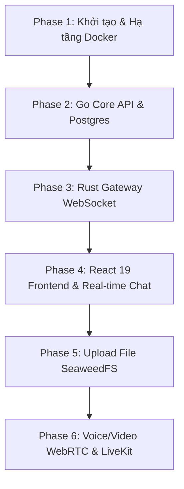

# Kế hoạch Triển khai Dự án Chat App Thế hệ Mới (Step-by-Step)

Kế hoạch này vạch ra từng bước chi tiết để xây dựng ứng dụng chat microservices từ cơ bản (cơ sở hạ tầng, API cốt lõi) đến nâng cao (real-time chat, upload media, cuộc gọi thoại/video WebRTC) dựa trên các file thiết kế tại [design](file:///d:/HoangLong/Dev/chat/design).

---

## User Review Required

> [!IMPORTANT]
> - **Lựa chọn Framework Frontend:** Thiết kế đề xuất **React 19 + Vite** (SPA) thay vì Next.js vì ứng dụng chat hoạt động sau khi đăng nhập và không cần SEO, giúp tối ưu hiệu năng re-render thông qua React Compiler mới.
> - **Công nghệ Message Queue:** Chúng ta sẽ cài đặt mặc định là **NATS.io** kết hợp với **Valkey** để chạy local tối ưu RAM tốt nhất (dưới 2GB RAM cho toàn hệ thống).
> - **Mô hình Thư mục:** Chúng ta sẽ phát triển theo mô hình Monorepo (tất cả code frontend và backend nằm chung một repository lớn để dễ dàng quản lý).

---

## Open Questions

> [!NOTE]
> 1. Bạn muốn đặt tên dự án chính thức là gì để thiết lập các package/module name (ví dụ: `gocord`, `nextchat`, `spacechat`)?
> 2. Bạn có muốn bắt đầu với cấu hình Database là PostgreSQL và Valkey/NATS ngay từ đầu không, hay chạy bằng các mock database/in-memory trước?

---

## Kế Hoạch Triển Khai Từng Bước (Phases)

### Phase 1: Thiết lập cấu trúc & Môi trường Docker (Tuần 1)
Bước đi nền móng, chuẩn bị hạ tầng để chạy ứng dụng local.
*   **Bước 1.1:** Khởi tạo cấu trúc thư mục Monorepo:
    *   `/backend/core-api` (Golang)
    *   `/backend/gateway` (Rust)
    *   `/frontend` (React 19 + Vite)
    *   `/proto` (Chứa các file định nghĩa gRPC `.proto`)
*   **Bước 1.2:** Viết file `docker-compose.yml` để chạy các service phụ thuộc local:
    *   PostgreSQL (Cơ sở dữ liệu chính)
    *   Valkey (Cache, State Sharing, Stream)
    *   NATS.io (Message Queue & Pub/Sub)
    *   SeaweedFS (Lưu trữ file)
*   **Bước 1.3:** Định nghĩa Protobuf (`/proto/auth.proto`, `/proto/gateway.proto`) để chuẩn bị cho giao tiếp gRPC giữa Rust Gateway và Go Core API.

### Phase 2: Phát triển Core API bằng Golang (Tuần 2)
Xây dựng trái tim xử lý logic của ứng dụng.
*   **Bước 2.1:** Thiết lập cấu trúc dự án `core-api` theo mô hình **Clean Architecture** (Domain -> Repository -> Usecase -> Delivery). Tích hợp GORM hoặc sqlx để kết nối PostgreSQL.
*   **Bước 2.2:** Thực hiện tính năng Authentication:
    *   Đăng ký / Đăng nhập.
    *   Tích hợp mã hóa mật mã bằng bcrypt và phát hành **PASETO Token** bảo mật cao.
*   **Bước 2.3:** Thực hiện các API nghiệp vụ chính:
    *   Tạo/Quản lý Workspace (Servers).
    *   Tạo/Quản lý Kênh chat (Channels - hỗ trợ type Text và Voice).
    *   Quản lý thành viên và phân quyền trong Server.

### Phase 3: Xây dựng Rust Gateway & WebSocket (Tuần 3)
Cửa ngõ kết nối thời gian thực chịu tải cao.
*   **Bước 3.1:** Thiết lập dự án `gateway` bằng Rust + Axum + Tokio.
*   **Bước 3.2:** Tích hợp gRPC client trong Rust để gọi sang Go Core API nhằm xác thực Token khi Client kết nối WebSocket.
*   **Bước 3.3:** Tích hợp kết nối Valkey/NATS trong Rust:
    *   Khi client connect, đăng ký trạng thái Online vào Valkey.
    *   Đăng ký lắng nghe sự kiện trên kênh Pub/Sub tương ứng với các Channel của client.
*   **Bước 3.4:** Viết luồng định tuyến tin nhắn:
    *   Nhận tin từ Client -> Đẩy vào NATS/Valkey stream.
    *   Nhận tin từ NATS/Valkey -> Đẩy về đúng WebSocket connection của client đang online.

### Phase 4: Frontend React 19 & Đồng bộ Real-time (Tuần 4-5)
Đưa giao diện vào hoạt động và kết nối dữ liệu.
*   **Bước 4.1:** Khởi tạo Frontend bằng Vite + React 19 + Tailwind CSS v4. Cấu hình cấu trúc thư mục Feature-based.
*   **Bước 4.2:** Tích hợp **Zustand** (quản lý giao diện, active channel, sidebar state) và **TanStack Query** (cache dữ liệu API).
*   **Bước 4.3:** Thiết kế UI 2-Stage Collapsible Sidebar (Slim Nav + Content Explorer) và khung chat sử dụng thư viện **Radix UI** + **Shadcn/ui** với giao diện bo góc mềm mại (`radius-xl`).
*   **Bước 4.4:** Viết Custom Hook `useWebSocket` để duy trì kết nối tới Rust Gateway.
*   **Bước 4.5:** Thực hiện đồng bộ dữ liệu: Khi có tin nhắn mới từ WS, cập nhật cache TanStack Query để hiển thị ngay lập tức lên giao diện mà không cần reload trang. Tích hợp Virtual List để hiển thị mượt mà.

### Phase 5: Hệ thống Upload File Siêu Tốc (Tuần 6)
*   **Bước 5.1:** Go Core API: Viết API `/api/files/presign-upload` sinh ra Presigned URL để upload trực tiếp lên SeaweedFS S3-API.
*   **Bước 5.2:** Frontend: Triển khai kéo thả file. Client gọi API lấy Presigned URL, sau đó dùng `axios` gửi lệnh `PUT` đẩy file trực tiếp lên SeaweedFS kèm theo thanh tiến trình (Progress Bar).
*   **Bước 5.3:** Gửi tin nhắn chứa liên kết file qua WebSocket sau khi upload thành công.
*   **Bước 5.4 (Tùy chọn):** Viết Background Service xử lý nén ảnh và tạo thumbnail bất đồng bộ.

### Phase 6: Tính năng Cuộc gọi Voice/Video Call WebRTC (Tuần 7)
*   **Bước 6.1:** Bổ sung cấu hình **LiveKit Server** và **Coturn** (STUN/TURN) vào file `docker-compose.yml`.
*   **Bước 6.2:** Go Core API: Tích hợp LiveKit SDK để tạo phòng gọi và phát hành token tham gia phòng cho client.
*   **Bước 6.3:** Thiết lập luồng báo hiệu cuộc gọi (WebRTC Signaling) 1-1 thông qua WebSocket của Rust Gateway.
*   **Bước 6.4:** Frontend: Tích hợp LiveKit React SDK để xử lý kết nối stream âm thanh/video.
*   **Bước 6.5:** Thiết kế giao diện gọi điện:
    *   Thanh điều khiển nổi (Dynamic Island Call Interface) khi chuyển kênh.
    *   Giao diện gọi Video thích ứng (Grid layout) và cửa sổ nhỏ nổi (Picture-in-Picture).

---

## Verification Plan

### Automated Tests
*   **Unit Test Backend (Go):** Sử dụng `testing` của Go để kiểm tra các Usecase (Auth, Workspace, Channel).
*   **gRPC Test:** Sử dụng `grpcurl` hoặc viết script nhỏ để test giao tiếp gRPC giữa các service.
*   **WebSocket Load Test:** Sử dụng công cụ `k6` hoặc `artillery` để test tải kết nối WebSocket trên Rust Gateway.

### Manual Verification
*   Mở đồng thời nhiều trình duyệt ẩn danh để test nhắn tin real-time chéo giữa các tài khoản.
*   Kiểm tra chức năng tắt mạng, ngắt kết nối đột ngột xem WebSocket có tự động reconnect và đồng bộ tin nhắn cũ hay không.
*   Test kéo thả file ảnh lớn và kiểm tra tiến trình hiển thị có mượt mà hay không.
*   Test gọi điện 1-1 và gọi nhóm trên môi trường mạng nội bộ để đảm bảo WebRTC hoạt động tốt.
